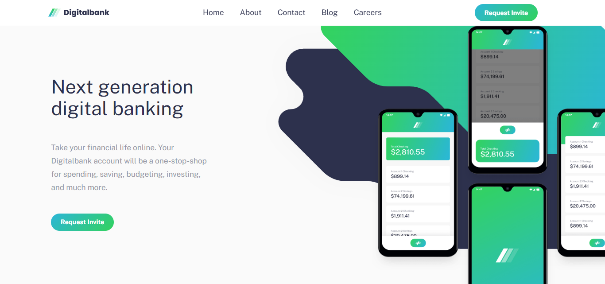
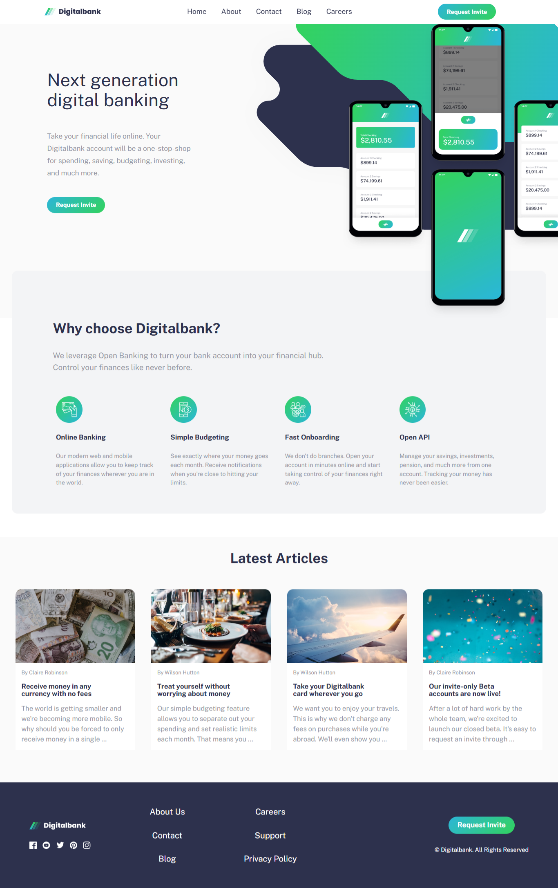
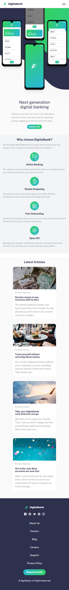
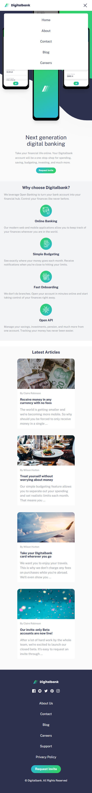

# Frontend Mentor - Digitalbank landing page solution

This is a solution to the [Digitalbank landing page challenge on Frontend Mentor](https://www.frontendmentor.io/challenges/digital-bank-landing-page-WaUhkoDN). Frontend Mentor challenges help you improve your coding skills by building realistic projects.

## Table of contents

- [Overview](#overview)
  - [The challenge](#the-challenge)
  - [Screenshot](#screenshot)
  - [Links](#links)
- [My process](#my-process)
  - [Built with](#built-with)
  - [What I learned](#what-i-learned)
  - [Continued development](#continued-development)
  - [Useful resources](#useful-resources)
- [Author](#author)
- [Acknowledgments](#acknowledgments)


## Overview

### The challenge

Users should be able to:

- View the optimal layout for the site depending on their device's screen size
- See hover states for all interactive elements on the page

### Screenshot







### Links

- Solution URL: (https://github.com/jacey10/fm-digitalbank-landing-page)
- Live Site URL: (https://jacey10.github.io/fm-digitalbank-landing-page/)

## My process

### Built with

- Semantic HTML5 markup
- CSS custom properties
- Flexbox
- CSS Grid
- Mobile-first workflow

### What I learned

- I learned how to how to animate the menu button to an X on open, instead of using or adding an extra element as close button.

```css
.menu--btn.open .bar:nth-child(1) {
  transform: translateY(7px) rotate(45deg);
}

.menu--btn.open .bar:nth-child(2) {
  opacity: 0;
  transform: scaleX(0);
}

.menu--btn.open .bar:nth-child(3) {
  transform: translateY(-7px) rotate(-45deg);
}
```
- I learned how to use one set of nav links for both desktop header and mobile menu overlay. The nav which is originally in the header is the single source of truth. Instead of duplicating the navs, I cloned the one in the header and added it to the menu overlay once the menu button is clicked.

```js
function openMenu() {
  if (!overlay.querySelector('header nav')) {
    const nav = document.querySelector('header nav');
    const clonedNav = nav.cloneNode('true');
    overlay.appendChild(clonedNav);
  } 
  overlay.classList.add('open');
  menuBtn.classList.add('open');
  menuBtn.setAttribute('aria-exapnded', true);   
}
```

### Continued development
- I would take my time to learn how to improve my animation skills.

## Author

- Website - [Jacey Blog](https://www.jacey.hashnode.dev/)
- Frontend Mentor - [@jacey10](https://www.frontendmentor.io/profile/jacey10)
- Twitter - [@jacey_muna](https://x.com/jacey_muna)
